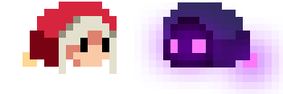

<!-- PROJECT LOGO -->
 

  

<h1 align="center">Mana's Journey</h1>
  
  <h3 align="center">Description</h3>
  

    Tp1 du cours de programmation de jeu
  

### Sources
https://dani-maccari.itch.io/platformer-metroidvania-pixel-items-free-assets
